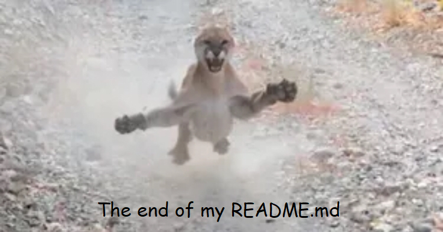

### Hi there! Im AestheticalZ, AKA Aesthetical.

- 🔭 I’m currently working on:
An FPS game, FlagPFP, and another game.

- 🌱 I’m currently learning:
Japanese, deeper C#, and more.

- 👯 I’m looking to collaborate on:
Nothing since popular repositories now use soydev languages like TS.

- 🤔 I’m looking for help with:
SharpCat's Java version (Java's reflection is absolute trash, please help).

- ⚡ Fun fact:
I cannot keep my attention focused on a task for more than 1 minute!

- 💾 Programming languages:
C# (favorite), Java (sort of?), JS (abandoned it), C++, BlitzBasic (kinda)

I really don't know why github chose my first ever github repo for the artic vault stuff, it feels embarassing af

